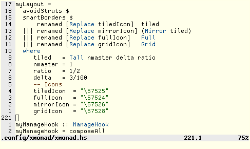

# Limepie

Limepie is a bitmap font for programming, all glyphs should be easily
discernible.



## Installation

```sh
~ $ git clone https://github.com/toniz4/limepie	
~ $ cd limepie
~ $ cp *bdf ~/.local/share/fonts/
```
